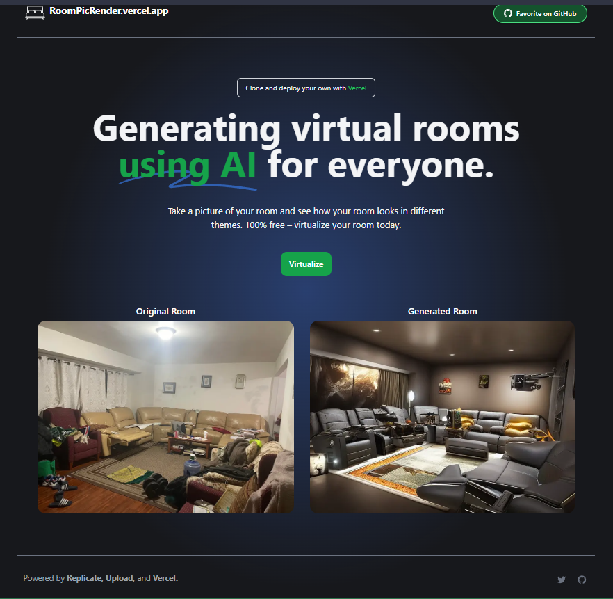

# [RoomPicRender](https://RoomPicRender.vercel.app) - virtualize your room with AI

This is cloned and based on the RoomGPT.io project, I have added my own style and made it more geared towards virtualizing a room and seeing what it could look like with a different look, instead of reorganizing it.

[](https://vercel.com/new/clone?repository-url=https://github.com/Nutlope/roomGPT&env=REPLICATE_API_KEY&project-name=room-GPT&repo-name=roomGPT)

[](https://RoomPicRender.vercel.app)

## How it works

It uses an ML model called [ControlNet](https://github.com/lllyasviel/ControlNet) to generate variations of rooms. This application gives you the ability to upload a photo of any room, which will send it through this ML Model using a Next.js API route, and return your generated room. The ML Model is hosted on [Replicate](https://replicate.com) and [Upload](https://upload.io) is used for image storage.

## Running Locally

### Cloning the repository the local machine.

```bash
git clone https://github.com/Rorschach3/RoomPicRender.git
```

### Creating a account on Replicate to get an API key.

1. Go to [Replicate](https://replicate.com/) to make an account.
2. Click on your profile picture in the top left corner, and click on "API Tokens".
3. Here you can find your API token. Copy it.

### Storing the API keys in .env

Create a file in root directory of project with env. And store your API key in it, as shown in the .example.env file.

If you'd also like to do rate limiting, create an account on UpStash, create a Redis database, and populate the two environment variables in `.env` as well. If you don't want to do rate limiting, you don't need to make any changes.

### Installing the dependencies.

```bash
npm install
```

### Running the application.

Then, run the application in the command line and it will be available at `http://localhost:3000`.

```bash
npm run dev
```

## One-Click Deploy

Deploy the example using [Vercel](https://vercel.com?utm_source=github&utm_medium=readme&utm_campaign=vercel-examples):

[](https://vercel.com/new/clone?repository-url=https://github.com/Rorschach3/RoomPicRender&env=REPLICATE_API_KEY&project-name=RoomPicRender&repo-name=roomGPT)

## License

This repo is unlicensed.
